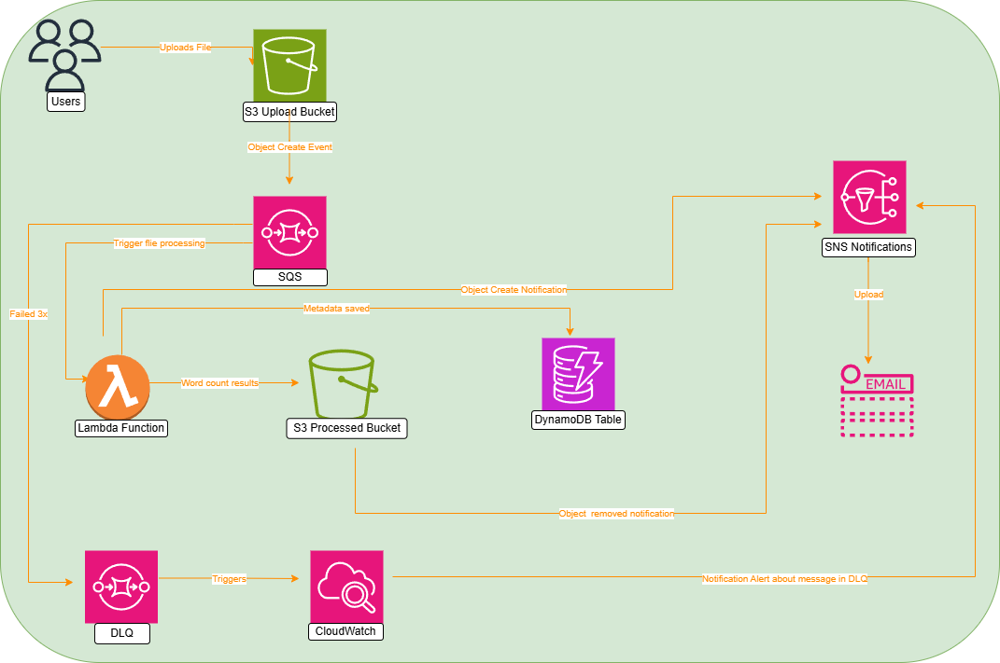

# 🚀AWS Serverless Text Processing Pipeline

## Overview

This project demonstrates a serverless text processing pipeline using AWS Lambda, API Gateway, and Amazon S3.

The system automatically processes uploaded `.txt` files, extracts metadata, persists results, and generates real-time notifications — without provisioning or managing servers.

The architecture follows cloud-native design principles including:

- Event-driven workflows
- Service decoupling
- Managed services
- Horizontal scalability
- Operational visibility

---

## 🏗️ Architecture

  

### Flow

1. A user uploads a `.txt` file to the S3 upload bucket  
2. S3 sends an event notification to an SQS queue  
3. Lambda is triggered by messages from the SQS queue  
4. The Lambda function:
   - Downloads the file
   - Counts the words in the text
   - Stores metadata in DynamoDB
   - Writes the processed output to a separate S3 bucket
   - Publishes an SNS notification
5. If processing fails, the message is retried and eventually moved to a Dead Letter Queue (DLQ)
6. CloudWatch monitors the DLQ and can trigger alerts if failures accumulate
---

## AWS Services Used

- **Amazon S3** — File upload and processed output storage
- **Amazon SQS** — Event queue for decoupled processing
- **Amazon SQS Dead Letter Queue (DLQ)** — Captures failed messages after retry attempts
- **AWS Lambda** — Serverless text processing (Python 3.11)
- **Amazon DynamoDB** — Stores file metadata and word counts
- **Amazon SNS** — Sends processing notifications
- **Amazon CloudWatch** — Logging, monitoring, and DLQ alarms

---

## Technical Highlights

- Fully serverless architecture
- Event-driven processing model
- DynamoDB metadata persistence
- Automated notification system
- Structured logging via CloudWatch
- Separation of upload and processed storage tiers
- Delete-event monitoring

---

## Repository Structure

- **architecture/** – system diagram
- **lambda/** – Lambda processing function
- **policies/** – SQS and SNS access policies
- **setup/** – step-by-step deployment guide
---

## Design Considerations

- Stateless compute via AWS Lambda
- Managed NoSQL storage with DynamoDB
- Decoupled notification service (SNS)
- Clear separation of ingestion and processed data
- CloudWatch logging for observability

---

## Future Enhancements

- Introduce Amazon SQS for message buffering and decoupling
- Add API Gateway for querying metadata
- Implement IAM least-privilege policies
- Convert infrastructure to Infrastructure-as-Code (Terraform or CloudFormation)
- Add automated tests and CI/CD pipeline

---

## Author

Built as a hands-on cloud engineering project to demonstrate practical serverless architecture skills.
